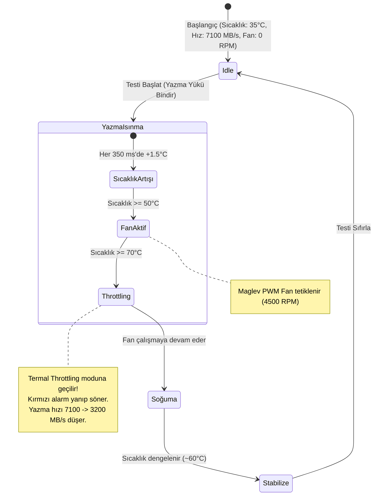

<p align="center">
  
</p>

<h1 align="center">🚀 ApexDrive Pro - Proje Yönetim Portalı</h1>

<p align="center">
  <strong>Yeni Nesil Aktif Soğutmalı Hibrit Depolama & Thunderbolt 4 Hub Çözümü için Uçtan Uca Proje Yönetim ve Simülasyon Platformu</strong>
</p>

<p align="center">
  <a href="#-teknolojik-altyapı"></a>
  <a href="#-teknolojik-altyapı"></a>
  <a href="#-teknolojik-altyapı"></a>
  <a href="#-teknolojik-altyapı"></a>
  <a href="#-teknolojik-altyapı"></a>
  
  
</p>

---

## 📋 Proje Tanımı ve Amacı

**ApexDrive Pro Proje Yönetim Portalı**, yeni nesil aktif maglev fanlı ve CNC gövdeli Thunderbolt 4 Hub & NVMe SSD ürün geliştirme projesinin (ApexDrive Pro) tüm kapsam, zaman planı (WBS/Gantt), bütçe, kaynak, risk ve kalite güvence aşamalarını uçtan uca izlemek, simüle etmek ve yönetmek için tasarlanmış **premium, etkileşimli ve tamamen istemci tarafında (Client-Side) çalışan bir Tek Sayfa Uygulamadır (SPA)**.

Bu portal, donanım tasarımı ve termal mühendislik gibi **Şelale (Waterfall)** disiplinlerinin yanı sıra firmware ve yazılım entegrasyonu gibi **Çevik (Agile)** süreçleri barındıran hibrit bir yönetim yapısını canlandırır.

### Proje Özeti:
*   **Toplam Proje Süresi:** 60 Gün (G16 - G60 zaman ölçeğinde)
*   **Proje Bütçesi:** ₺850.000 (Dinamik düzenlenebilir)
*   **Harcanan Bütçe:** ₺380.000 (Anlık güncellenir)
*   **Genel Proje İlerlemesi:** %42 (WBS görev ağırlıklarına göre otomatik hesaplanır)

---

## 💎 Temel Modüller ve Yetenekler

### 1. Durum Gösterge Paneli (Dashboard & KPIs)
*   **Dinamik İlerleme Göstergeleri:** WBS görev sürelerine göre otomatik olarak hesaplanan, dairesel ve yatay ilerleme barları.
*   **KPI Kartları:** Proje Faz Sayısı (4 Faz), Toplam Görev Sayısı, Tamamlanan/Aktif Görev Dağılımı ve Dinamik Toplam Bütçe kartları.
*   **Dinamik Bütçe Düzenleme:** Toplam Proje Bütçesi kartı yanındaki düzenleme butonu sayesinde bütçe miktarı kullanıcı tarafından dinamik olarak değiştirilebilir. Değişiklik anında tüm sayfalardaki göstergelere yansıtılır ve tarayıcı hafızasına (`localStorage`) kaydedilir.
*   **İlerleme Grafikleri (Chart.js):**
    *   *Proje Fazları Süre ve Durumu:* Fazların sürelerini ve tamamlanma durumlarını gösteren renk kodlu çubuk grafik.
    *   *Ekip Efor ve Maliyet Dağılımı:* Ekip üyelerinin atandığı görev sayılarını ve harcadıkları efor gün sayılarını gösteren karşılaştırmalı grafik.

### 2. Gelişmiş Gantt Şeması (Zaman Tüneli)
*   **G16-G60 Zaman Ölçeği:** Proje zaman çizelgesi, projenin gerçek takvimine uygun olarak G16 gününden başlayarak G60 gününe kadar 45 günlük bir süreyi ölçekler.
*   **Bölünmüş Panel Scroll Senkronizasyonu:** Sol taraftaki WBS görev listesi ile sağ taraftaki SVG Gantt zaman tüneli dikey eksende 1:1 senkronize şekilde kayar.
*   **Kritik Yol Analizi (CPM):** Projenin en uzun yolu (kritik yol) üzerinde bulunan görevler kırmızı renkli çubuklar ile gösterilir.
*   **Gantt Görsel Bileşenleri:**
    *   *Faz Özet Çubukları:* Ana fazları temsil eden, kenarları aşağı doğru kıvrılan MS Project stili özet çubukları.
    *   *Milestone (Kilometre Taşları):* Sarı elmas sembolleriyle gösterilen sıfır süreli kritik onay noktaları.
    *   *Ortogonal Bağımlılık Çizgileri:* Görevler arasındaki öncül-ardıl (dependency) ilişkilerini gösteren dinamik SVG okları. Kritik yoldaki bağımlılıklar kalın kırmızı çizgiyle vurgulanır.
    *   *Sorumlu Bilgisi (In-line Assignees):* Gantt barlarının hemen sağında sorumlu kişinin adı in-line olarak yazar.

### 3. İş Kırılım Yapısı & Görev Tablosu (WBS Grid)
*   Görev ekleme, düzenleme ve silme yeteneğine sahip interaktif tablo.
*   Öncelik derecelerine (Düşük, Orta, Yüksek, Kritik) göre renk kodlu etiketler.
*   Görev adı, sorumlu kişi ve öncelik durumuna göre arama ve filtreleme.
*   Kilometre taşı (Milestone) belirleme seçeneği.

### 4. Bütçe Takibi ve Maliyet Yönetimi
*   **Kategori Dağılımı Kartı:** Projenin toplam planlanan bütçesi ile o ana kadar gerçekleşen harcamaların dökümü. Bu alanda da değiştirilebilir toplam bütçe göstergesi ve edit butonu yer alır.
*   **Maliyet Karşılaştırma Grafiği:** Ekip üyelerinin planlanan bütçe limitleri ile harcanan tutarlarını karşılaştıran dinamik bar grafik.

### 5. Kanban Tahtası (Kanban Board)
*   Görevlerin durumlarına göre (`Bekliyor`, `Devam Ediyor`, `Tamamlandı`) üç farklı sütunda görselleştirilmesi.
*   Sütunlar arası geçişleri tetikleyen hızlı aksiyon butonları. Kanban üzerindeki güncellemeler anlık olarak dashboard verilerini ve Gantt şemasını günceller.

### 6. Risk Yönetim Matrisi (Risk Register)
*   Tedarik zinciri veya termal throttling gibi teknik risklerin yönetildiği alan.
*   Olasılık ve Etki seviyelerine göre dinamik olarak hesaplanan Risk Derecesi (Skoru).
*   Risk azaltma (Mitigation) eylem planlarının girilebileceği risk yönetim modülü.

### 7. Donanım Vitrini & Termal Stres Testi Simülatörü
ApexDrive Pro'nun aktif maglev fanlı ve CNC gövdeli termal yapısını test eden canlı telemetry ekranı:
*   **Telemetry Göstergeleri:** Gerçek zamanlı SSD Sıcaklığı (°C), Maglev Fan Hızı (RPM) ve Veri Yazma Hızı (MB/s).
*   **Stres Testi Akışı:**
    1.  SSD veri yazma yükü altında ısınmaya başlar (sıcaklık her 350 ms'de 1-2°C artar).
    2.  Sıcaklık **50°C**'ye ulaştığında Maglev PWM fanı devreye girer ve 4500 RPM hızla dönmeye başlar.
    3.  Sıcaklık **70°C** kritik eşiğine ulaştığında SSD kendini korumak için **Termal Throttling** moduna geçer; yazma hızı 7100 MB/s'den 3200 MB/s'ye düşürülür ve arayüzde kırmızı alarm göstergeleri yanıp söner.

### 8. Jira Backlog & Export Modülü
*   Jira standartlarına uygun backlog yapısı oluşturma, düzenleme ve Story Point (SP) atama.
*   Hazırlanan backlog verilerini tek tıkla **CSV** veya **JSON** formatında dışa aktarma (Jira Import uyumlu).

---

## 🛠️ Teknolojik Altyapı

Portal, modern web standartlarına ve performans kurallarına uygun olarak geliştirilmiştir:

*   **Arayüz Yapısı (Core):** [index.html](file:///c:/Users/Batuhan/Desktop/GPY/index.html) - Semantik HTML5 ve optimize edilmiş DOM yönetimi.
*   **Tasarım Sistemi & CSS:** [styles.css](file:///c:/Users/Batuhan/Desktop/GPY/styles.css) - Premium Vanilla CSS değişkenleri + dinamik yerleşimler için Tailwind CSS (Play CDN). Karanlık ve aydınlık mod tam uyumluluğu.
*   **İş Mantığı (Logic):** [app.js](file:///c:/Users/Batuhan/Desktop/GPY/app.js) - Vanilla JavaScript (ES6+) ile durum yönetimi (State Management) ve localStorage veri kalıcılığı.
*   **Grafikler & İstatistikler:** Karşılaştırmalı bütçe ve aşama grafiklerinin render edilmesi için **Chart.js**.
*   **Zaman Çizelgesi & Gantt:** Matematiksel CPM (Kritik Yol Metodu) hesaplamalarını ve SVG tabanlı dinamik çizimleri gerçekleştiren özel Gantt motoru.
*   **İkon Seti & Tipografi:** FontAwesome 6.4.0 vektörel ikon kütüphanesi ve Google Fonts Outfit yazı tipi.

---

## 📈 Proje Zaman Planı Akış Şeması

Aşağıdaki şemada proje fazlarının ve kritik yol görevlerinin zaman çizgisi ve kilometre taşları (Milestones) gösterilmiştir:

```mermaid
gantt
    title ApexDrive Pro Proje Zaman Planı (G16 - G60)
    dateFormat  X
    axisFormat Gün %h
    
    section Faz 1: Başlatma
    Pazar Analizi (1.1)               :active, p1, 16, 19
    M1: Tasarım Onayı (1.2)           :milestone, p2, 19, 19
    Teknik Gereksinim (1.3)           :active, p3, 19, 21
    Charter İmzalanması (1.6)         :active, p4, 21, 22
    Risk Planlama (1.9)               :p5, 24, 26
    
    section Faz 2: Tasarım
    3D CAD & Simülasyon (2.1)         :crit, active, p6, 26, 31
    Thunderbolt Şematik (2.2)         :active, p7, 28, 32
    PCB Layout (2.3)                  :crit, p8, 31, 36
    M2: Prototip Onayı (2.4)          :milestone, p9, 36, 36
    
    section Faz 3: Geliştirme
    NVMe Çekirdek Yazılımı (3.1)      :crit, p10, 41, 46
    Firmware Konfigürasyonu (3.3)     :crit, p11, 45, 49
    M3: Alpha Sürüm Yayını (3.5)      :milestone, p12, 50, 50
    
    section Faz 4: Test & Kapanış
    Termal Stres Testleri (4.1)       :crit, p13, 51, 55
    Fiziksel Dayanıklılık (4.3)       :p14, 55, 57
    Kapanış Raporu (4.5)              :p15, 58, 60
    M4: Proje Başarı Onayı (4.6)      :milestone, p16, 60, 60
```

---

## ⚡ Termal Telemetri Simülatör Mantığı

Uygulamanın **Donanım Vitrini** sekmesinde yer alan termal simülatör, bir SSD'nin yük altındaki çalışma durumunu ve koruma mekanizmalarını canlandırır. Bu durum makinesinin akış diyagramı aşağıdadır:



---

## 👥 Ekip Kaynakları ve Bütçe Dağılımı

Toplam proje bütçesi (₺850.000), aşağıdaki beş ana ekip kaynağına atanmıştır:

| Çalışan / Ekip | Rol | Günlük Ücret | Planlanan Limit (₺) | Gerçekleşen Harcama (₺) | Durum |
| :--- | :--- | :---: | :---: | :---: | :---: |
| **Batuhan Özdoğan** | PM / Proje Yöneticisi | ₺2.500 | ₺120.000 | ₺50.000 | <span style="color:#10b981">● Aktif</span> |
| **Halil İbrahim Kahraman** | Ar-Ge / Mekanik Tasarım | ₺2.000 | ₺250.000 | ₺150.000 | <span style="color:#10b981">● Aktif</span> |
| **Kıdemli Geliştirici** | Gömülü Yazılım Mühendisi | ₺1.800 | ₺200.000 | ₺80.000 | <span style="color:#10b981">● Aktif</span> |
| **Donanım Uzmanı** | Donanım / PCB Mühendisi | ₺1.600 | ₺180.000 | ₺100.000 | <span style="color:#10b981">● Aktif</span> |
| **Pazarlama / Ajans** | Lansman & Pazarlama | ₺1.200 | ₺100.000 | ₺0 | <span style="color:#f59e0b">● Beklemede</span> |

---

## 🚀 Kurulum ve Yerel Çalıştırma

Uygulama, bağımlılığı olmayan (sıfır dependency) statik bir istemci uygulamasıdır. Herhangi bir derleme (build) veya paket yükleme adımı gerektirmez.

### Hızlı Kurulum

Proje dosyalarının tarayıcı güvenlik politikalarını (CORS/ES Modülleri vb.) ihlal etmeden sorunsuz çalışabilmesi için yerel bir HTTP sunucusu üzerinden sunulması önerilir:

1.  **Projeyi Klonlayın veya İndirin:**
    ```bash
    git clone https://github.com/0batuhan/ApexDrive-Pro.git
    cd ApexDrive-Pro
    ```

2.  **Yerel Sunucu Başlatın (Aşağıdaki yöntemlerden birini seçin):**

    *   **Node.js (LTS) Yüklüyse:**
        ```bash
        npx http-server -p 8080
        ```
    *   **Python (v3+) Yüklüyse:**
        ```bash
        python -m http.server 8080
        ```
    *   **VS Code Kullanıyorsanız:**
        Projeyi açıp sağ alt köşedeki **Go Live** (Live Server eklentisi) butonuna basabilirsiniz.

3.  **Tarayıcıda Açın:**
    Tarayıcınızda `http://localhost:8080` adresini açarak uygulamayı kullanmaya başlayabilirsiniz.

---

## 💾 Tarayıcı Depolama Yönetimi (Cache Control)

Portal, tarayıcıda yapılan tüm veri değişikliklerini (yeni görev ekleme, bütçe güncelleme, durum değiştirme, risk/ekip güncellemeleri) otomatik olarak tarayıcının `localStorage` nesnesinde yedekler.

> [!TIP]
> Eğer yeni güncellemelerin veya şablon değişikliklerinin tarayıcınızda görünmediğini fark ederseniz:
> [app.js](file:///c:/Users/Batuhan/Desktop/GPY/app.js) dosyasındaki `CURRENT_DATA_VERSION` sürüm kodunu güncelleyebilirsiniz. Bu işlem, tarayıcının eski yerel depolama önbelleğini otomatik olarak temizleyerek en güncel şablon verilerinin yüklenmesini sağlar.

---

## 👨‍💻 Proje Ekibi ve Katkıda Bulunanlar

*   **Batuhan Özdoğan** - *Proje Yöneticisi & Baş Geliştirici*
*   **Halil İbrahim Kahraman** - *Ar-Ge & Mekanik Tasarım Lideri*